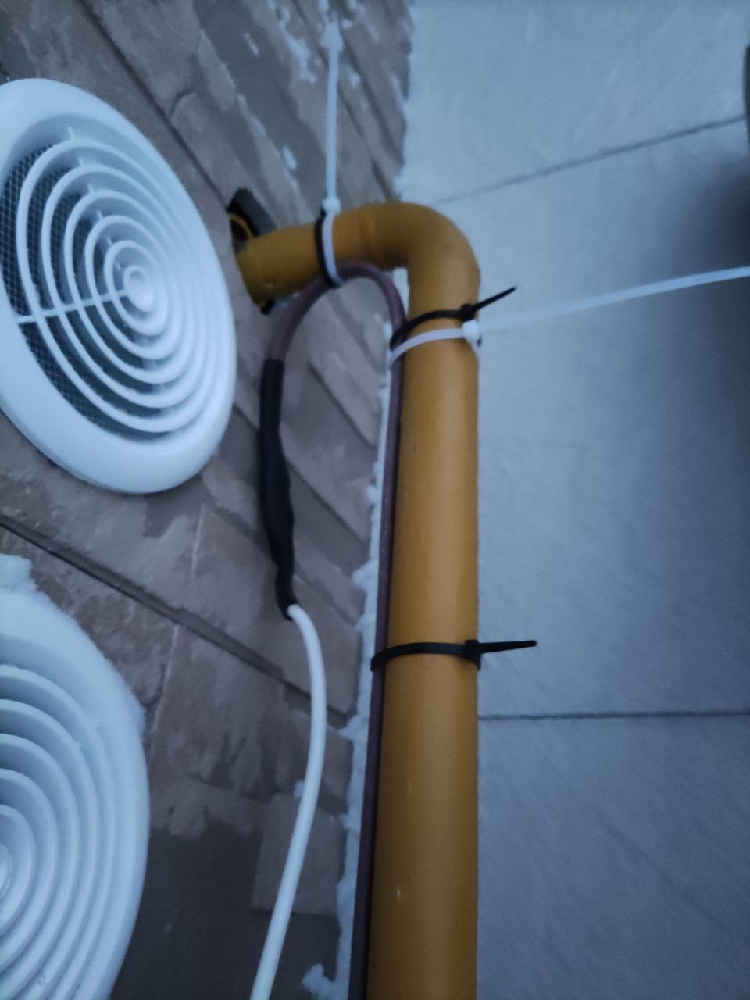
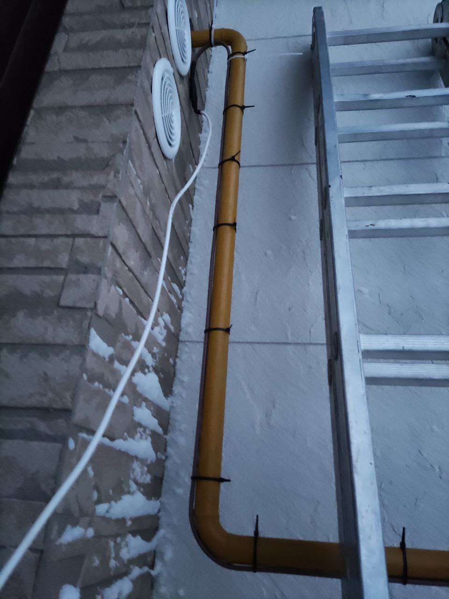
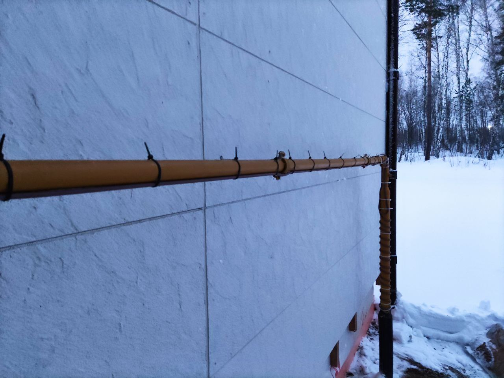
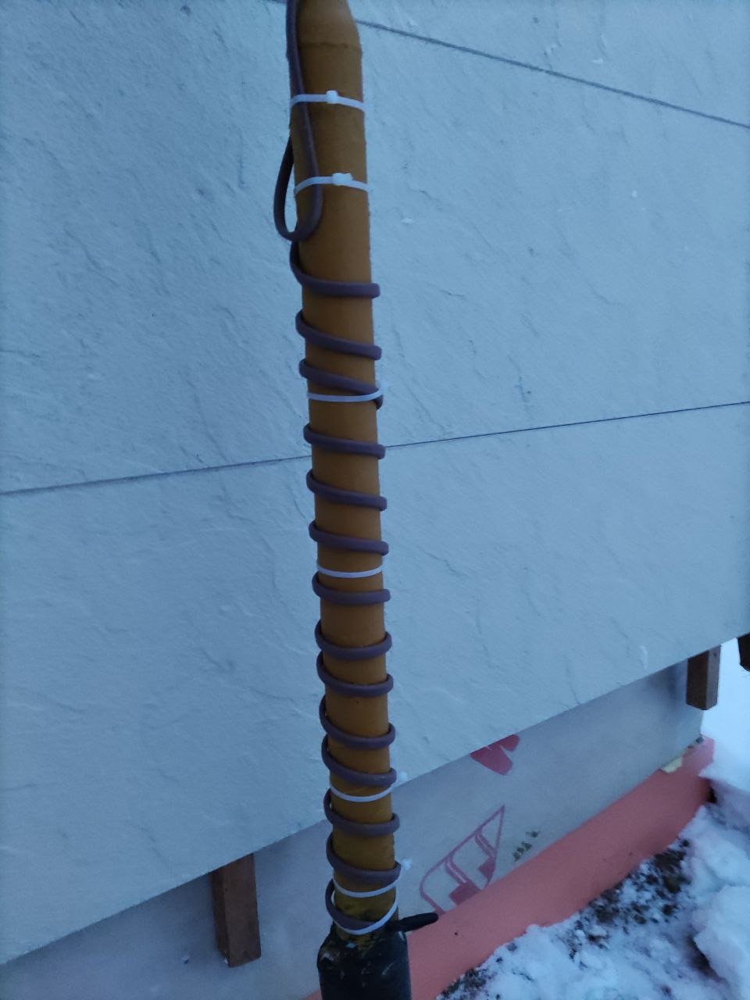
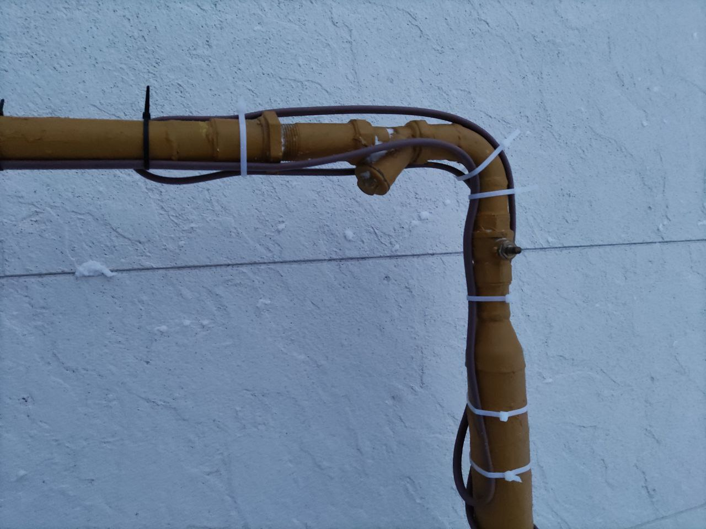
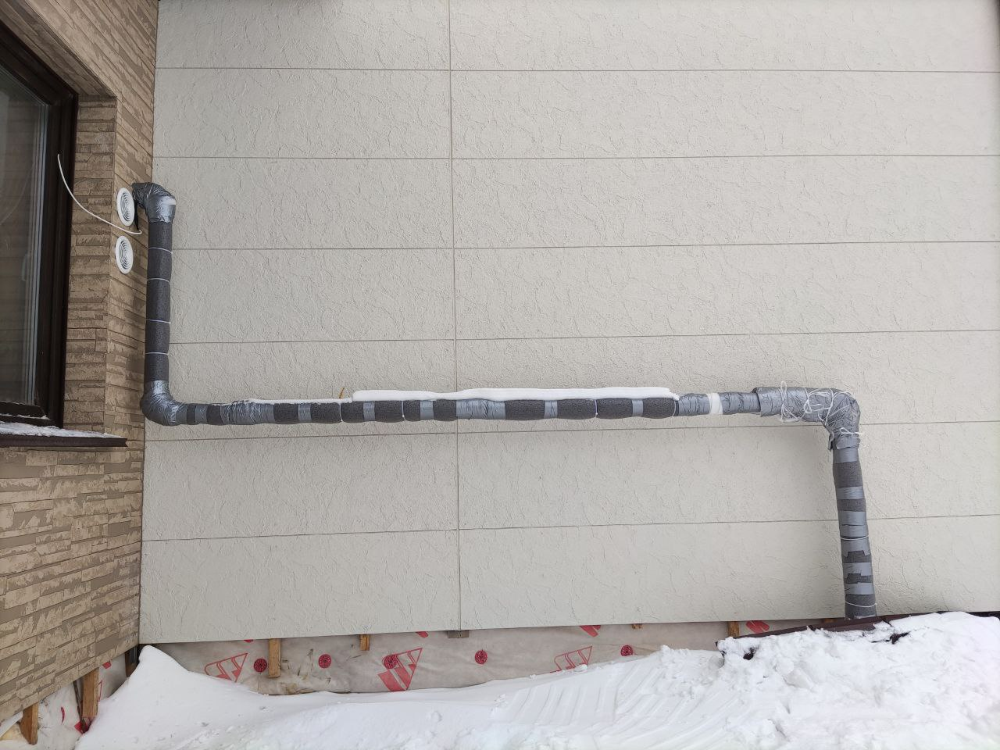
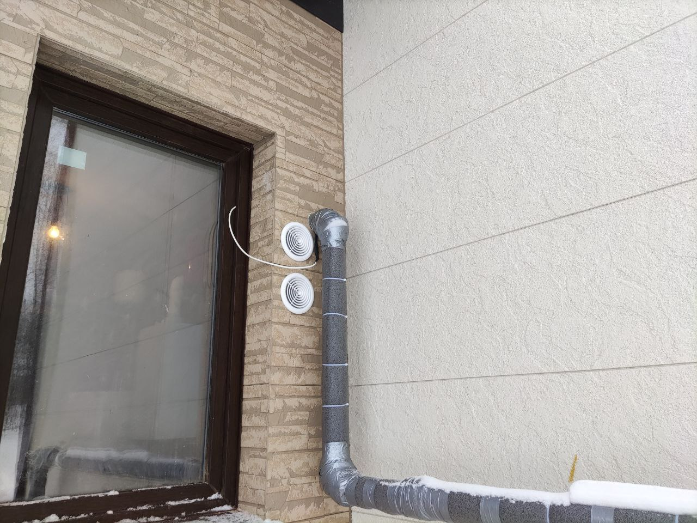
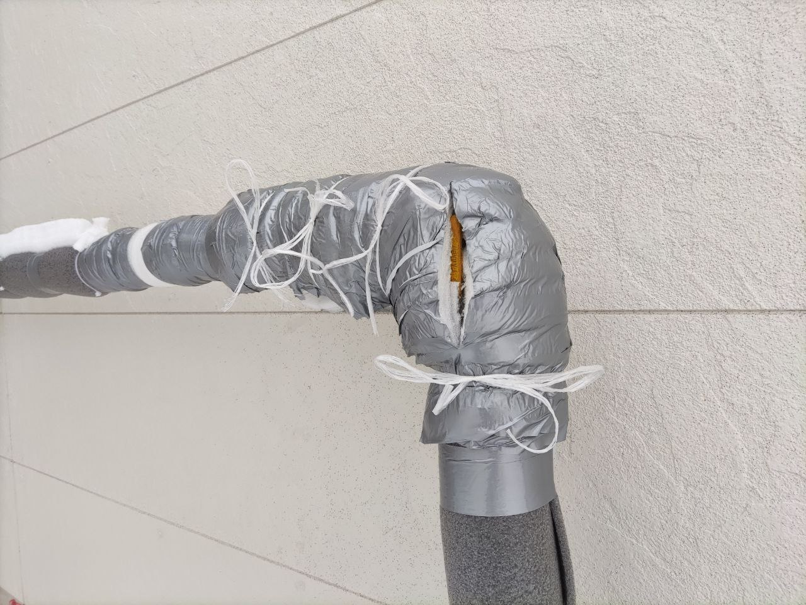

## About

Про греющий кабель для газовой трубы

## Введение

Когда-то при производстве земляных работ был повреждён газопровод (возможно, не один раз). В него попала вода. И теперь она постепенно испаряется, насыщая собой газ. Выходя в трубе на поверхность, водяные пары замерзают, и лёд перекрывает трубу. Особенно уязвимы фильтр и крановая зона. Для решения проблемы используем греющий кабель и утепляем трубу.

Обилие слов вроде "вроде" говорит о наличии у автора сомнений по данному факту. Прошу понять, простить и уточнять непонятное у газовиков или в чате. Замечания и уточнения приветствуются.

## Параметры кабеля 

Греющий кабель закупали совместно через группу в Телеге. Брали [Grandeks 30-2CR UF](https://gizbar.com/greyuschiy-kabel-ekranirovannyy-grandeks-30-2cr-uf/).

Кто-то говорит, что 30Вт/м - слишком мощный. Но с Виктором из Кедра я согласовал. Также он должен быть с допуском для использования с газовой трубой. Других требований вроде нету.

Комплект кабеля (в сборе) состоит из:
- Собственно греющего кабеля
- Подводящего питание провода ПВС
- Штепсельной вилки

### Длина

Длина рассчитывается индивидуально в зависимости от длины трубы и расстояния от розетки. Я себе считал так.

Параметры газовой трубы.
- Футляр из ПНД-трубы над землёй - 60 см 
- Толстая труба (D = 60 мм) до крана - 90 см
- Крановая зона с фильтром - 50 см
- Остальная труба (D = 32мм) - 400 см

Параметры кабеля.
- 2 м на толстую трубу
- 1.5 м на крановую зону 
- 4 м остальное 
- Опционально 1 м опустить в футляр (*)
- Итого 8.5 м + 5 м подводящий кабель

В итоге получилось отлично, только подводящий кабель длинноват, но его специально с запасом взял.

(*) Это тоже совет из чата. Необязательное действие, лучше без особой необходимости его не совершать. Газовики кому-то посоветовали так сделать. Я не стал, т.к. не было нужно. Может, благодаря двойному утеплению, может, морозов таких не было, может, повезло.

## Монтаж

### Последовательность

Бывалые в чате рекомендуют делать так.

1. Перед монтажом кабель включить в розетку (особенно полезно на морозе). Он становится гибким, и можно руки погреть. 
2. На 32мм-трубу приклеить кабель вдоль алюминиевым скотчем. 
3. Возле крановой зоны (где самое уязвимое место - вероятнее всего перемерзает) бросить петлю (тройной кабель).
4. На 60мм-трубу кабель намотать.
5. Сверху примотать утеплитель из ВПЭ (вспененного полиэтилена). Есть [специальный](https://novosibirsk.leroymerlin.ru/product/izolyaciya-dlya-trub-izodom-43-9mm-17997636/) [трубный](https://novosibirsk.leroymerlin.ru/product/izolyaciya-dlya-trub-izodom-110-9mm-17997652/) утеплитель в Леруа.
6. Углы промотать демпферной лентой (которая используется для стяжки, сделана из того же ВПЭ), потом разрезать и привязать верёвкой. Эта зона должна быть разборной (требования газовиков).

### Пример результата

[//]: # (Так примотал кабель. Сначала на стяжки, потом алюминиевым скотчем местами, для лучшего прилегания.)

Так примотал кабель. Сначала на стяжки, потом алюминиевым скотчем местами, для лучшего прилегания.

Так в конце получилось. Крановая зона - разборная, с доступом к ручке перекрытия газа

### Замечания

- Раньше вроде газовики требовали, чтоб кабель они могли сами отключить. Теперь не требуют (я у Виктора узнавал).
- Раньше вроде нельзя было просовывать кабель через дырку в стене, где проходит газовая труба (опять же на уровне слухов). 
Но были случаи перемерзания газа именно в месте входа в дом.

## Особенности эксплуатации

1. С моим конденсационным котлом получилась ситуация: вода из газа конденсировалась где-то внутри котла, что-то переполнялось, и котёл уходил в ошибку. После двух разборов котла Виктор запретил включать кабель.
2. Замечено, что кабель со временем деградирует, перестаёт греть местами.

