## About

Инструкция по оплате взносов через Сбербанк Online.

Комиссия составляет 1% (на 22.12.2021).

## Порядок оплаты

1. Зайти в Сбербанк Online, нажать "Платежи и переводы".

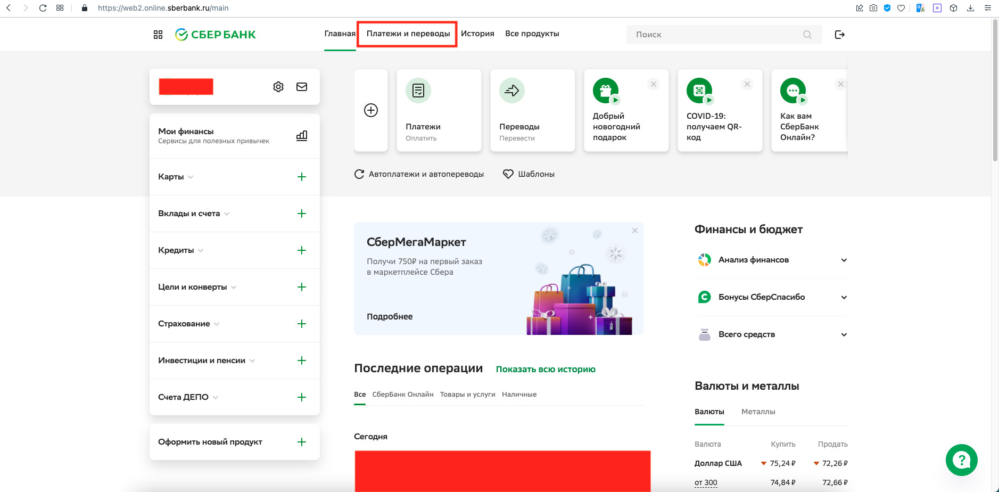

2. В секции "Платежи" выбрать пункт "Платёж по реквизитам".

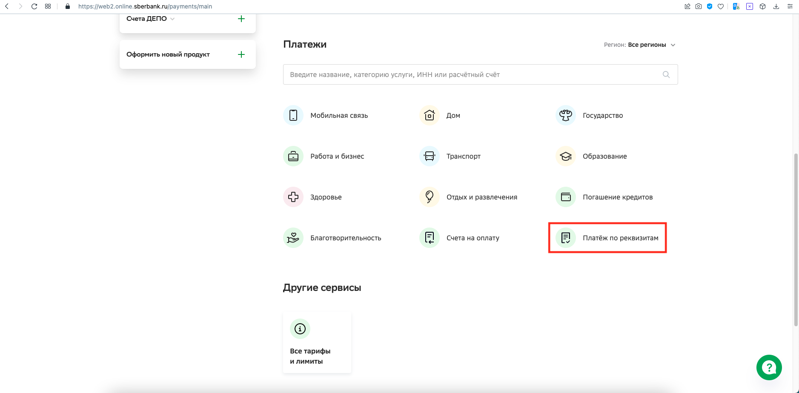

3. Ввести ИНН получателя. Его можно найти [здесь](README.md). Нажать "Продолжить".

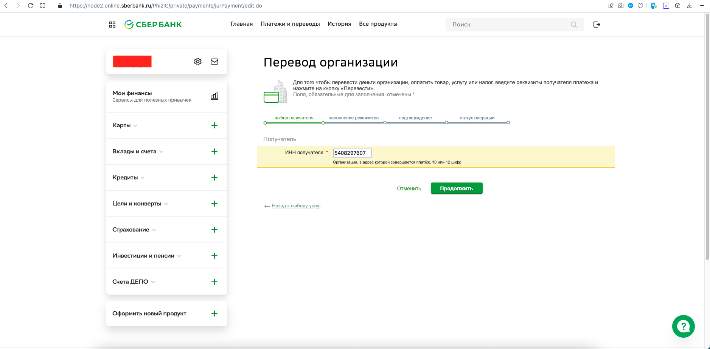

4. Ввести счёт получателя и БИК банка получателя. Их можно найти [здесь](README.md). Нажать "Продолжить".

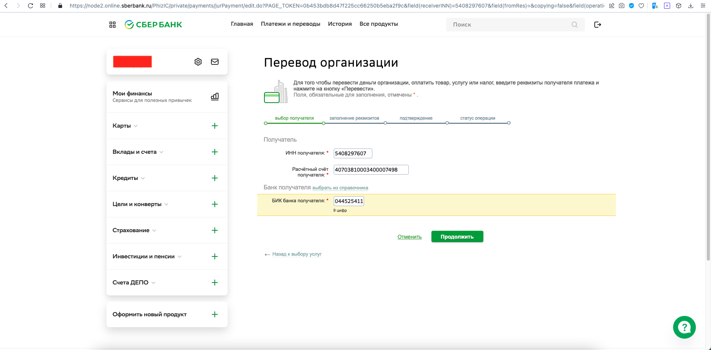

5. Появится окошко, в котором я выбрал "ЖСК СИГМА".

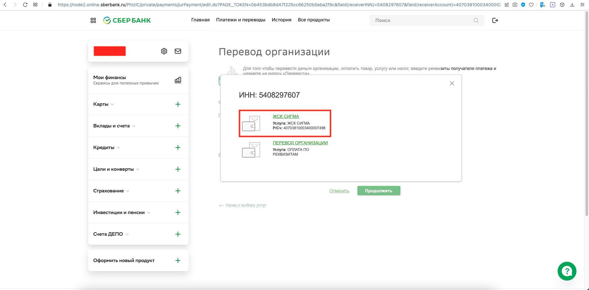

6. Выбрать счёт, с которого платить и ввести ФИО плательщика. Нажать "Продолжить".

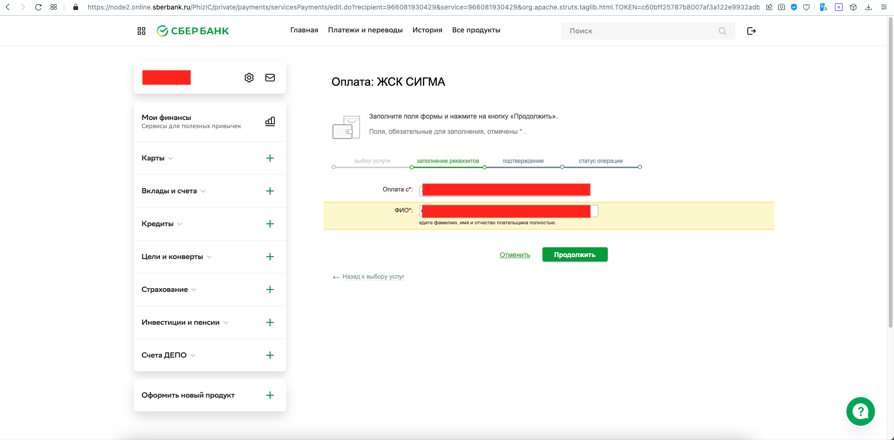

7. Заполнить поле "Назначение платежа". Важно написать так: "Компенсационный взнос за энергоресурсы, `Фамилия пайщика`, `код оплаты`, без НДС". Про код можно прочитать [здесь](README.md). Выбрать "НДС не облагается". Нажать "Продолжить".

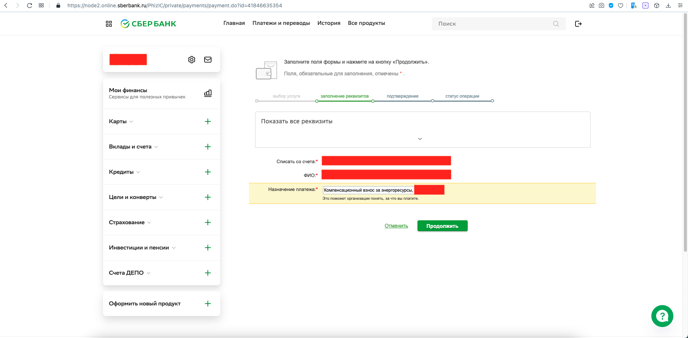

8. Ввести сумму платежа. Нажать "Продолжить".

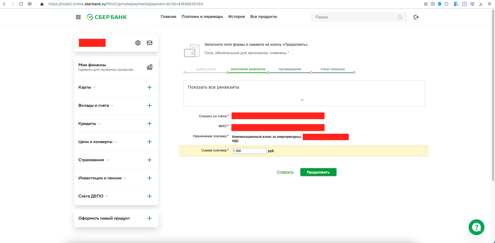

9. Ознакомиться с комиссией. Нажать "Оплатить ...".

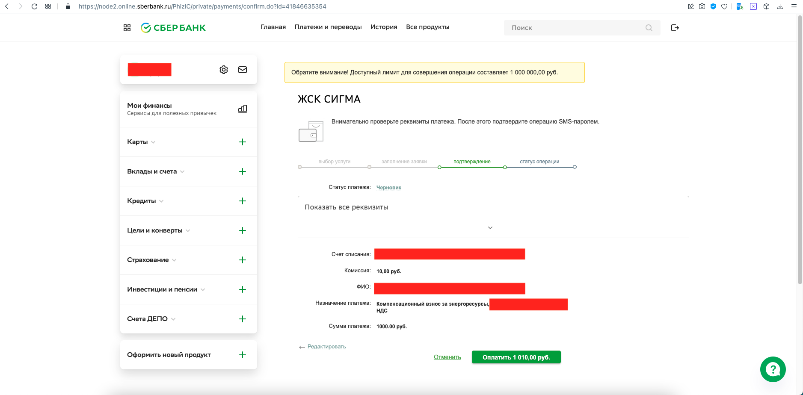

10. Ввести код из СМС. Нажать "Подтвердить".

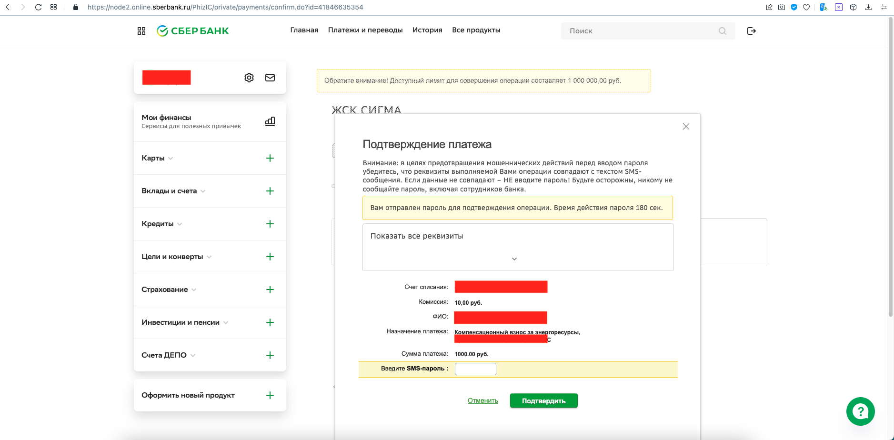

## Создание шаблона платежа

Чтобы не вводить реквизиты заново каждый раз, можно сохранить платёж как шаблон.

1. Сразу после подтсверждения платежа на странице его статуса нажать "Сохранить как шаблон"

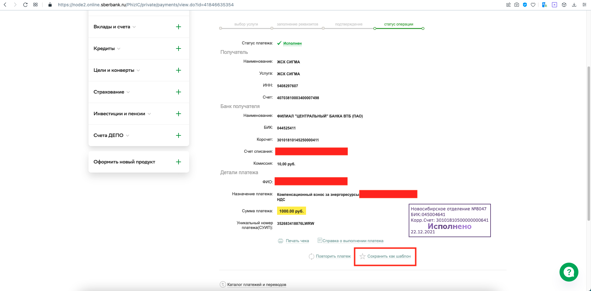

2. Придумать название (лучше только из латинских букв, чтоб потом в СМС использовать). Нажать "Сохранить".

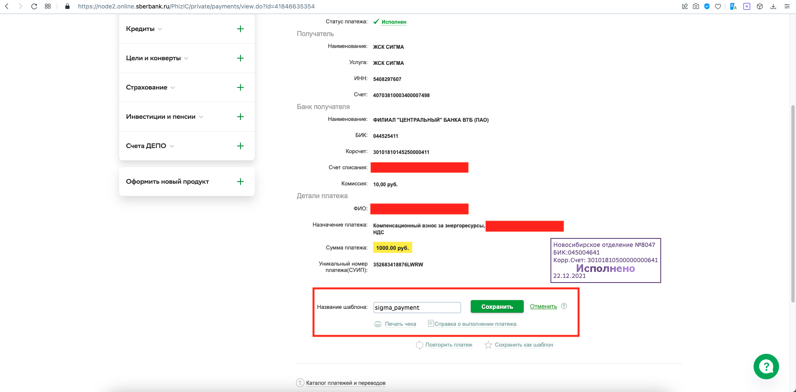

3. Ввести код из СМС. Нажать "Подтвердить".

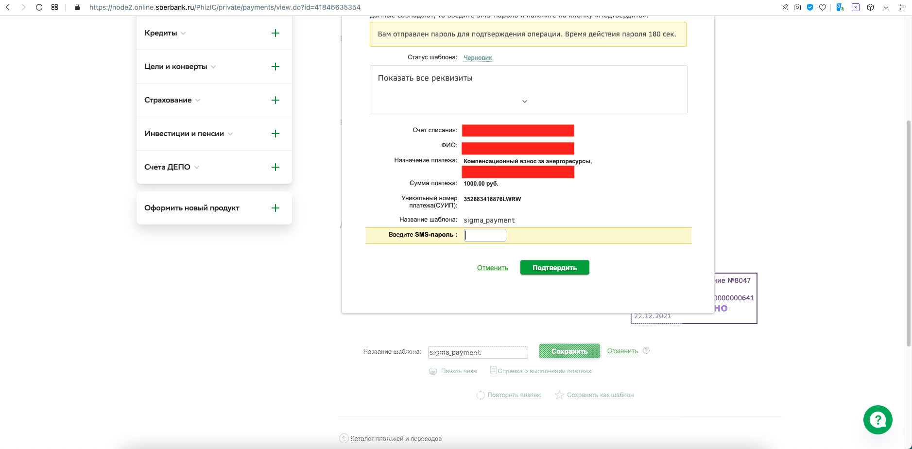
