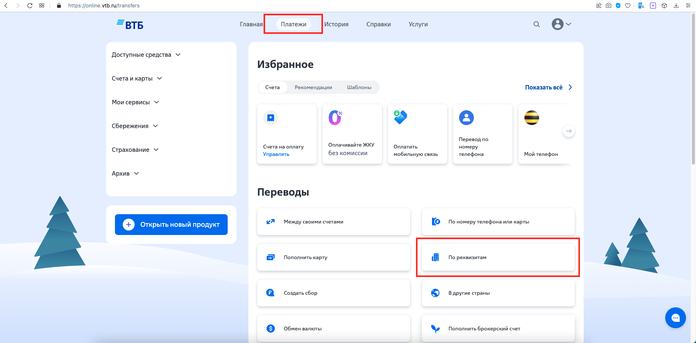
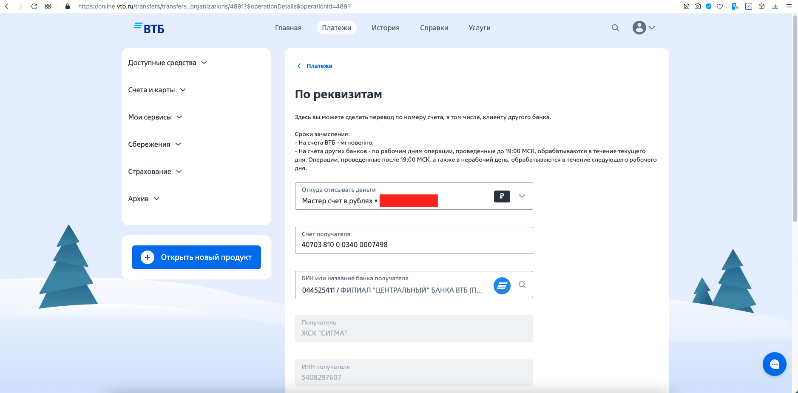
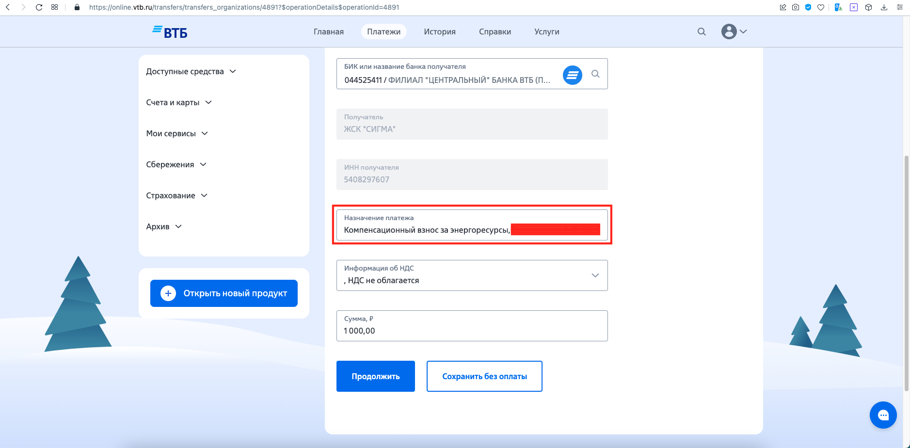
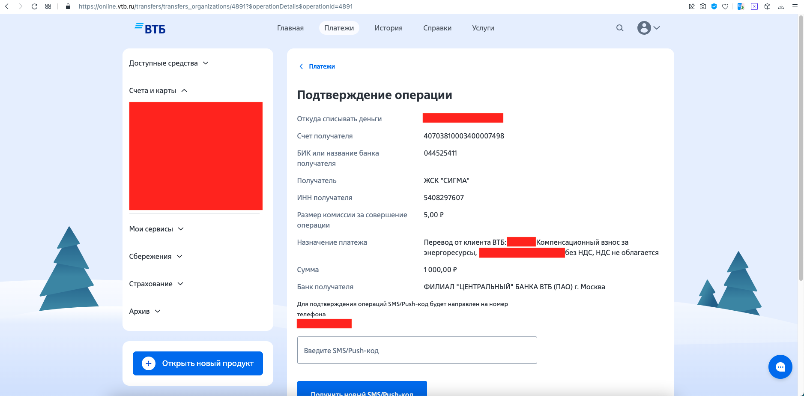
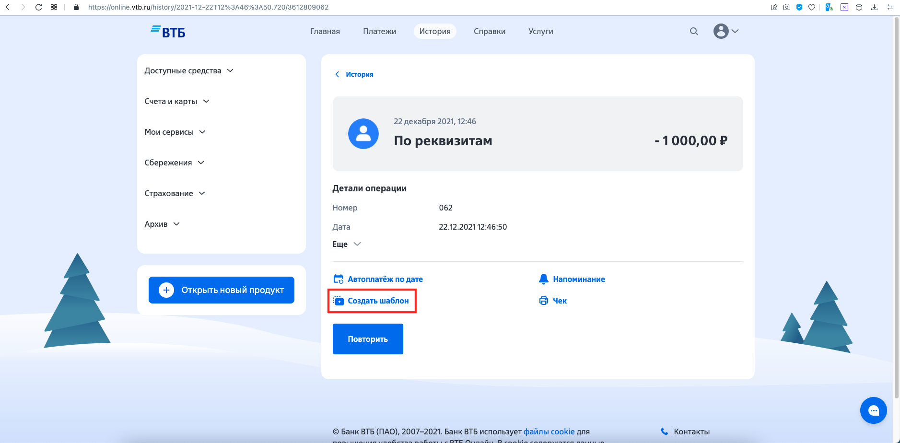
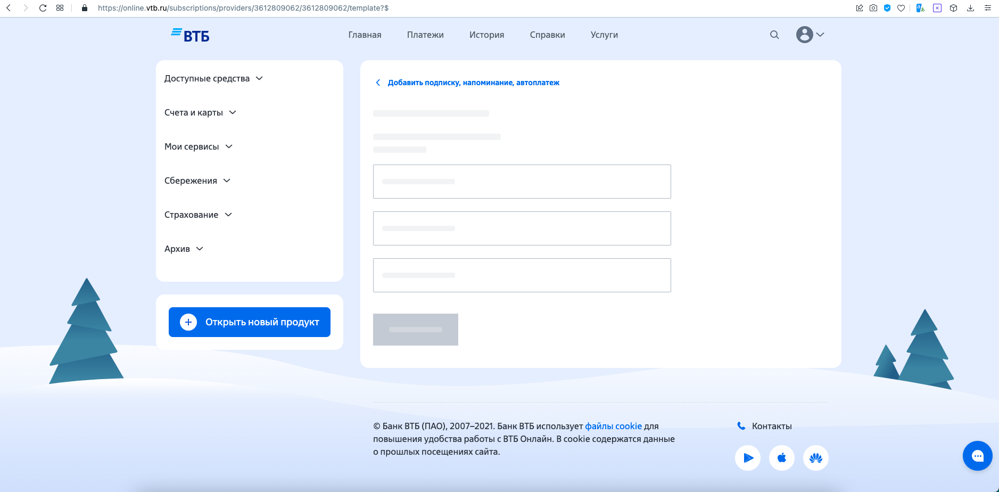

## About

Инструкция по оплате взносов через ВТБ Online.

Комиссия отсутствует (на 26.07.2024).

## Порядок оплаты

1. Зайти в [ВТБ Online](https://online.vtb.ru/), перейти во вкладку "Платежи", в секции "Переводы" выбрать пункт "По реквизитам".

2. Ввести счёт получателя и БИК банка получателя. Их можно найти [здесь](README.md#реквизиты-жск-сигма). 

3. Заполнить поле "Назначение платежа". Важно написать так: "Компенсационный взнос за энергоресурсы, `Фамилия пайщика`, `код оплаты`, без НДС". Про код можно прочитать [здесь](README.md#код). Выбрать "НДС не облагается", ввести сумму. Нажать "Продолжить".

4. Ввести код из СМС.

## Создание шаблона платежа

Чтобы не вводить реквизиты заново каждый раз, можно сохранить платёж как шаблон.

1. Перейти во вкладку "История", выбрать сделанный недавно платёж в Сигму.
   

2. Нажать "Создать шаблон".

3. Страница когда-нибудь загрузится, и можно будет продолжить .

